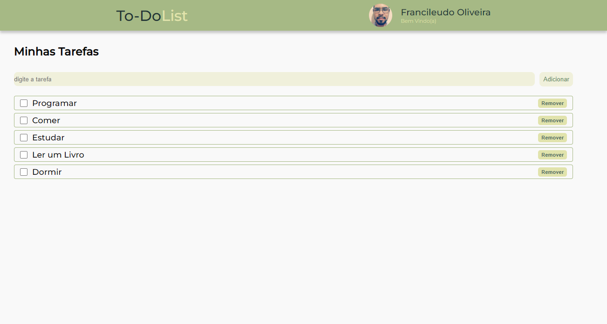

<div align='center' id='top'>

 
&#xa0;
 
<!-- <a href='linkdosite'>Demo</a> -->
 
</div>
 
<h1 align='center'>To-Do List</h1>
 
<p align='center'>
 

 

 

 


</p>
 
<p align='center'>
<a href='#dart-sobre'>Sobre</a> &#xa0; | &#xa0;
<a href='#sparkles-funcionalidades'>Funcionalidades</a> &#xa0; | &#xa0;
<a href='#rocket-tecnologias'>Tecnologias</a> &#xa0; | &#xa0;
<a href='#white_check_mark-pré-requesitos'>Pré requisitos</a> &#xa0; | &#xa0;
<a href='#checkered_flag-começando'>Começando</a> &#xa0; | &#xa0;
<a href='#memo-licença'>Licença</a> &#xa0; | &#xa0;
<a href='https://github.com/fransilva0' target='_blank'>Autor</a>
</p>
 
<br>
 
## :dart: Sobre ##

<p>
  O projeto foi desenvolvido em conjunto com o Walisson Silva no vídeo do canal da <a href="https://www.youtube.com/watch?v=jlE08ODf-CA">Let's Code</a> Onde aprendi funcionalidades básicas do ReactJs. Ao longo do projeto modifiquei a estilização no que diz respeito as cores trazendo, ao final, algo mais chegado a tons de verde. Após o vídeo, foi preciso verificar o código do projeto da Let's Code, neste <a href="https://github.com/Letscode-br/lc-challenge-web/tree/main/web-challenge1">Link</a>, para adicionar as funcionalidade a seguir mencionadas abaixo. 
</p>

<p>
  Além disso, ao inves de escrever todo o funcionamento do To-Do List no arquivo App.jsx, resolvi utilizar o que foi aprendido na vídeo-aula e construí separado, assim como o Header. Desenvoli bastante os conhecimentos em ReactJs, entendo funcionamentos e conceitos.
</p>
 
## :sparkles: Funcionalidades ##
 
:heavy_check_mark: Adicionar Tarefa;
:heavy_check_mark: Alterar Status da Tarefa;
:heavy_check_mark: Remover Tarefa;
 
## :rocket: Tecnologias ##
 
As seguintes ferramentas foram usadas na construção do projeto:

- [Node.js](https://nodejs.org/en/)
- [React](https://pt-br.reactjs.org/)
 
## :white_check_mark: Pré requisitos ##
 
Antes de começar :checkered_flag:, você precisa ter o [Git](https://git-scm.com) e o [Node](https://nodejs.org/en/) instalados em sua maquina.
 
## :checkered_flag: Começando ##
 
```bash
# Clone este repositório
$ git clone https://github.com/fransilva0/To-Do-List
 
# Entre na pasta
$ cd To-Do-List
 
# Instale as dependências
$ yarn
 
# Para iniciar o projeto
$ yarn start
 
# O app vai inicializar em <http://localhost:3000>
```
 
## :memo: Licença ##
 
Este projeto está sob licença MIT. Veja o arquivo [LICENSE](LICENSE.md) para mais detalhes.
 
 
Feito com :heart: por <a href='https://github.com/fransilva0' target='_blank'>Francileudo Oliveira</a>
 
&#xa0;
 
<a href='#top'>Voltar para o topo</a>